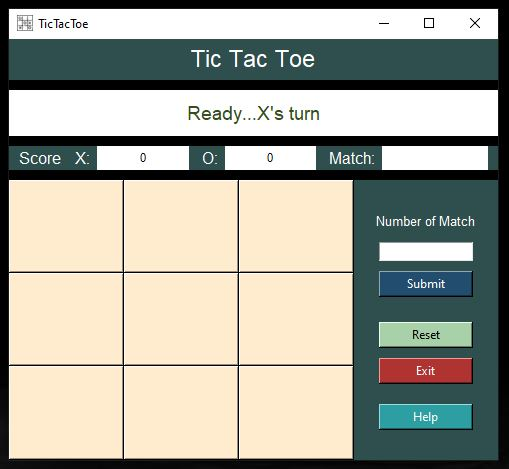
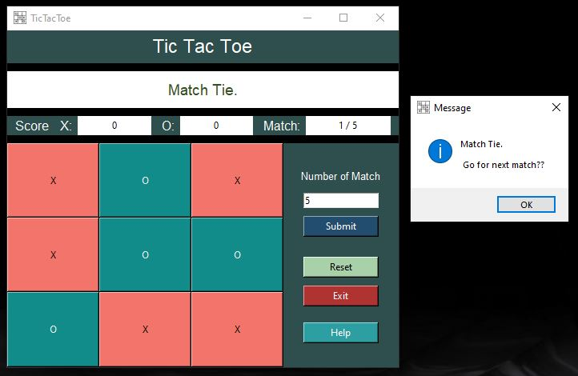
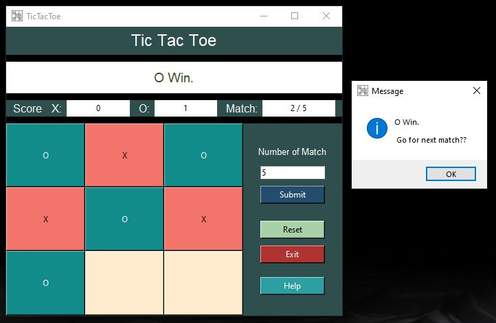

# Tic-Tac-Toe with GUI

How to execute code:
You will first have to download the repository as a .zip file and then extract the contents into a folder. Then you can open the folder as in a compiler such as PyCharm or SublimeText3.

